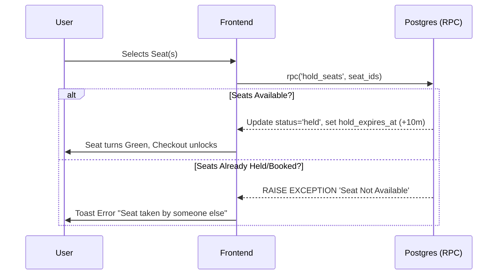
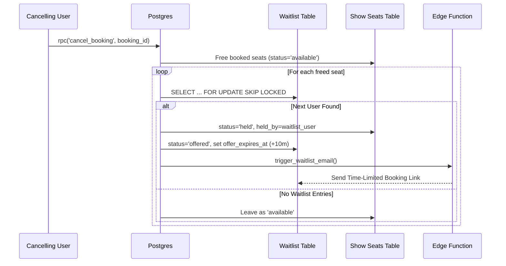
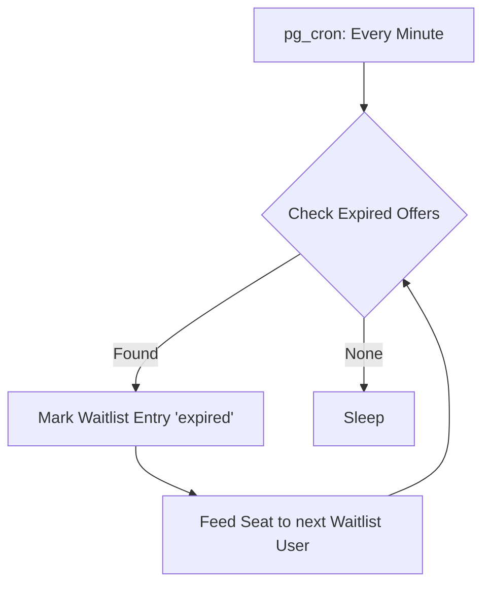

# System Design: Unthinkable Seat Booking Platform

This document outlines the architecture, concurrency control, and logic flows powering the high-throughput seat booking and waitlist mechanisms. The platform is designed around PostgreSQL (Supabase) to strictly enforce transactional integrity and prevent race conditions.

## 1. Concurrency Prevention & Isolation

High-demand events are notorious for concurrency issues—multiple users attempting to book the exact same seat simultaneously. 

To solve this, the platform utilizes strict database-level locking and status isolation instead of relying on frontend validation. 
- All critical mutations happen via **Postgres Functions (RPCs)** which run inside atomic transactions.
- We rely heavily on the `FOR UPDATE` and `FOR UPDATE SKIP LOCKED` clauses.
- **`SKIP LOCKED`**: Essential for the waitlist assignment flow. When looping over cancelled seats and querying for the next waiting customer, `SKIP LOCKED` guarantees that if multiple concurrent transactions are processing waitlists, they will seamlessly skip over rows that are already being processed by another transaction, entirely avoiding deadlocks and double-offers.

## 2. Seat Hold and TTL Mechanism

Instead of requiring upfront payment to reserve a seat, we use a Time-To-Live (TTL) soft-hold mechanism. This dramatically improves user experience by securing their selection while they navigate the checkout flow.

### Architecture
- The `show_seats` table acts as the source of truth for seat states. 
- It uses three primary statuses: `available`, `held`, and `booked`.
- The `hold_seats(seat_ids)` RPC updates selected seats to `held`, sets `held_by = auth.uid()`, and injects a TTL via `hold_expires_at = now() + 10 minutes`.

### Hold Flow Diagram

## 3. Waitlist Queue & Auto-Assignment Flow

When a seating category hits capacity (`available = 0`), the UI switches to "Sold Out" and unlocks the Waitlist capability.

### Ticket Quantity Support
Users can join the waitlist and request multiple tickets. Rather than grouping these into a single complex database row, the `join_waitlist` RPC inserts **one queue row per requested ticket**. This guarantees granular, one-to-one mapping between freed seats and waitlist progression, preventing situations where a user who wants 4 tickets permanently blocks the line because only 2 seats keep cancelling.

### Waitlist Flow Diagram

## 4. Time-Limited Offer Handling

Waitlist offers must be strictly time-boxed to ensure that if a user is asleep or ignores the email, the seat doesn't remain deadlocked forever.

### The Lifecycle of an Offer
1. **Offer Sent**: The seat is hard-reserved (`held`) specifically for the waitlisted user's `uid`. The waitlist row is updated to `status = 'offered'` with a 10-minute expiration.
2. **Acceptance**: If the user clicks the email link, they call `accept_waitlist_offer()`. This transitions the waitlist entry to `fulfilled` and resets the seat's `hold_expires_at` for another 10 minutes, giving them time to process payment.
3. **Expiration**: We use `pg_cron` running every 60 seconds (`expire-waitlist-offers-cron`). It scans for `offer_expires_at <= now()`. It transitions expired offers to `expired` status and instantly loops the abandoned seat back into `process_waitlist_for_seat()`, bumping it to the *next* person in line automatically without manual admin intervention.

### Expiration Loop Diagram

